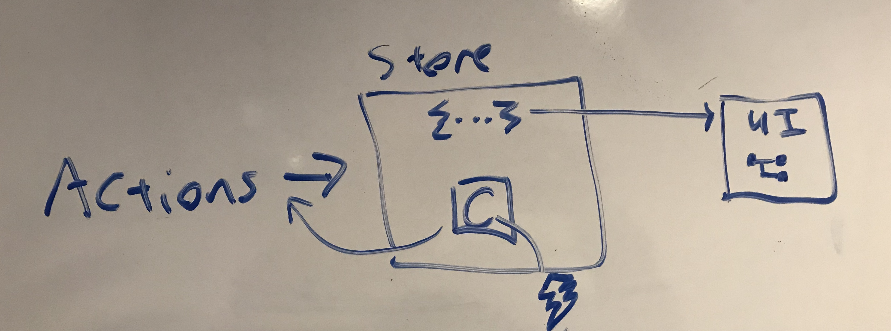
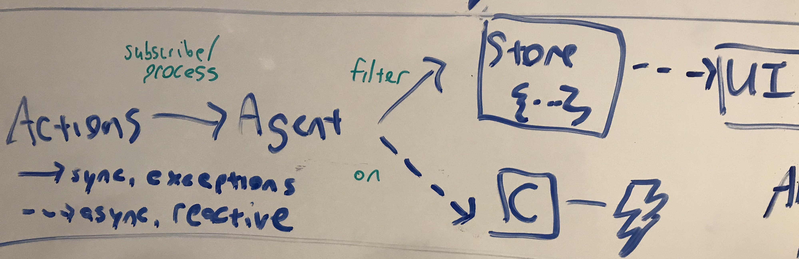

autoscale: true
build-lists: true
theme: Fira, 3

## Top 5 Reactive Use Cases With Antares/RxJS

### Dean Radcliffe

## t : `@deaniusol`

---

## Keeping It Real(-time) with Antares and RxJS

### Dean Radcliffe

## t : `@deaniusol`

---


^ Family Pic

---


^ Music Pic 1

---


^ Music Pic 2

---


^ Out of Order Messages

---


^ Intermittent failures

---


^ Incremental Loading Issues

---


---


^ So I'm here to help you (\*) Manage Async With Antares

<!--


---


---

-->


<!--


-->

---

## Comparison: Antares Agent vs Redux Store


---



---



---


---


---

<!--
# Antares Render Options

- On actions of certain types or criteria
- In batches, throttled, or time-adjusted

~~switchMap~~
~~concatMap~~
~~mergeMap / flatMap~~

- parallel / serial
- cutoff / mute

^ Question: But what if multiple rendererings would overlap?

---
-->


---


---


---

# Parallel _"Piano Polyphony"_


^ The 'default' choice for rendering is parallel mode. Run any new renderings in parallel with any existing.
If a new rendering process begins while another is already in progress, just start it up too, and allow it to overlap the previous.
Like notes on a piano. Pianos can sound many keys at once without running out of memory.

---

# Cutoff _"Clarinet Concurrency"_


^ You don't want old auto-complete results
^ That situation is no longer valid like sessionTimeout
^ Cancel future consequences

---

# Serial _(sequence of steps)_


^ Put another dime in the jukebox, still gotta wait for the song to finish

---

# Mute _😤 STFU_


^ Enough already
^ Clicking the elevator button more won't make it come any faster!

---

## Non-canceling and Canceling Concurrency Modes

| Mode       | Eagerly Consumes | RxJS               |
| ---------- | ---------------- | ------------------ |
| `parallel` | memory, CPU, I/O | `mergeMap/flatMap` |
| `serial`   | system memory    | `concatMap`        |

| Mode     | Cancels/Prevents | RxJS        |
| -------- | ---------------- | ----------- |
| `cutoff` | oldest           | `switchMap` |
| `mute`   | newest           | –           |

---

## Bonus: ajaxStreamingGet

^ How many have made a REST call for an array?
^ What's the difference between local call for an array and remote call for an array?

^ Riddle: What's the saner of the following two processes?

---

| Process 1     | Process 2     |
| ------------- | ------------- |
| Chunk arrived | Chunk arrived |
| Record 1      |               |
| Record 2      |               |
| Chunk arrived | Chunk arrived |
| Record 3      |               |
| Record 4      |               |
| Chunk arrived | Chunk arrived |
|               | Records 1-4   |

^ Raise your hand if you think Process 2 is the saner one!

---

## A Promise For a Document

## _OR_

## A process that produces results

---

# Streaming Repo List

https://deanius.github.io/antares

---

<!--

| Unix Process        | Observable                      |
| ------------------- | ------------------------------- |
| 0-∞ results (lines) | 0-∞ results via `next`          |
| `$?` exit code      | `complete`, `error` callbacks   |
| däɘmon              | may not call `complete`/`error` |
| `kill -9`           | unsubscribe                     |

```
> ls -1   # echo "$?"           o.subscribe({
.gitignore                          next(o){ ; }
config.rb                           error(e){ ; }
package.json                        complete(){ ; }
webpack.config                  })
```

---

-->

# Definition

> Observable - An object that represents a process
> that produces results

^ Can represent a handle to any external process! (REST, WebSocket, any async operation)
^ The most underused data type!

---

# What you can't do with a Promise

- Define but not start it
- Get multiple results (example: output lines)
- Cancel it while in flight

^ Don't start what you don't know how to finish!

<!--

# What you can do with a Process

- Define but not start it
- Get an exit code
- Get multiple results (example: output lines)
- Cancel it while in flight

-->

---

# Streaming Repo List

https://deanius.github.io/antares

- #slow

^ Fin!

---


---

# Hotel California


---

# Resources

https://github.com/deanius/hotel-california

- Live at http://antares-hotel.herokuapp.com
- React/Redux, RxJS
- RxJS
- REST, WebSockets/realtime
- Create React App + NodeJS
- Storybook

---

# Resources

https://deanius.github.io/antares

- Link to Antares Github Repo, Issues, Etc.
- RxJS (Subject), TypeScript
- Canvas
- Promises, ajaxStreamingGet
- Antares API Docs (TypeDoc)
- Good Reading

---

# The End

# Thank You!

Star It! 🤩 ⭐️ github.com/deanius/antares ⭐ 🤩️

- Dean @deaniusol
