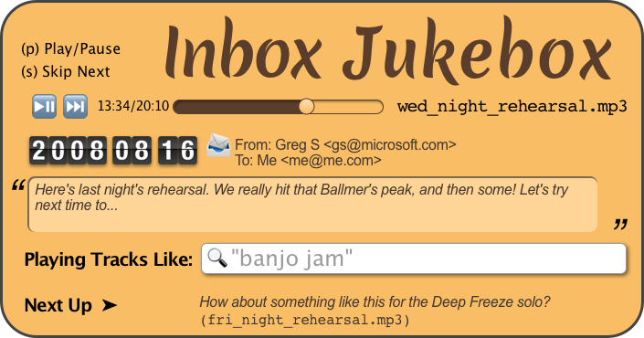
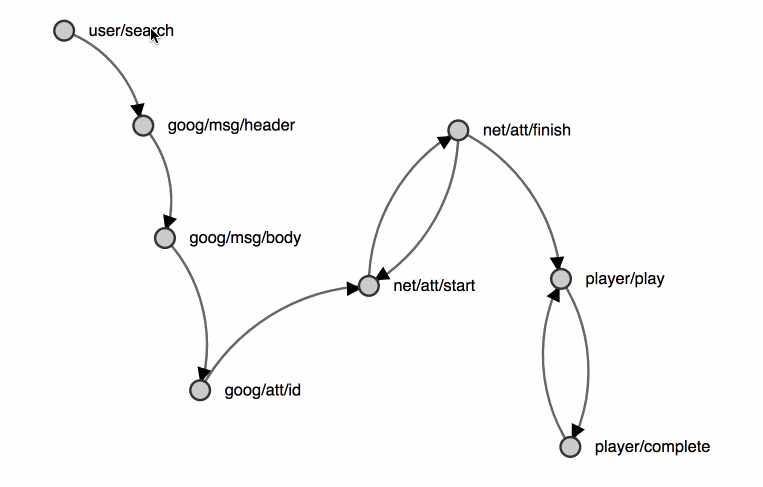

autoscale: true
build-lists: true

## The Music of Async with Observables and Rx-Helper

### Dean Radcliffe

## t : `@deaniusol`


---


<!--


^ Music Pic 1

---


^ Music Pic 2
-->

---


^ Intermittent failures

---


^ Out of Order Messages

---


^ Incremental Loading Issues

---


---


^ So I'm here to help you (\*) Manage Async With Antares

---


---

# Event Handlers

## no `trigger` warning!

---

# Promises

## So slow, I can hardly `await` 🙄

---

# Incidental Complexity

## Where is `stdin`?

^ FileWriterSpeaker

---

# FileWriter/Speaker

**Given:** A source of names
**When:** A name is encountered
**Then:** It should be written to a yaml file
**And:** Written to other, as of yet TBD places

---


---

# FileWriter/Speaker

## Let's _Do It Live!_

---

# FileWriter/Speaker Conclusions

## Observables:

- Data type for Events/Computation over time
- Are sequenced more readily than Promises because they are:
  - lazy
  - cancelable
- As a return value, encapsulate a source
- Can model a `stdin` stream inside an app
- Can model external infrastructure

---


---

# Concurrency Options


---

# Parallel: _"Polyphony"_ (mergeMap)


^ - ⭐ Liking many pictures

- ️Independent events

---

# Serial: _"SetList"_ (concatMap)


^ - "Add to Playlist"

- Queue up
- Limited resources.
- Sierra Alexa song-hopping

---

# Cutoff: _"Clarinet"_ (switchMap)


^ - Session timeout / autocomplete

- NOT enqueuing songs (1 song replaces/cuts-off the last)
- Changing chatrooms
- "There can be only one!"

---

# Mute: _"Not Now I'm Busy"_ (exhaustMap)


^ - The elevator button.

- Toggle a switch.
- Declan double-stomping the sweeper toggle.

---


---

# Inbox Jukebox!

---



---

# Inbox Jukebox

**Given**: You have media files in your inbox (mp3, m4a, etc)
**When**: You OAuth this application to your Gmail
**Then**: You should hear a stream of those files
**And**: You can customize that subset

---

```
 user/search: q: Greg
  📨 goog/msg/header: subject: Friday gig
  📨 goog/msg/header: subject: Great jam
    📨 goog/msg/body: subject: Friday gig, att: []
    📨 goog/msg/body: subject: Great jam, att: [jam.mp3, jam2.mp3]
    📨 goog/att/id: att: jam.mp3
    📨 goog/att/id: att: jam2.mp3
  🛰 net/att/start: att: jam.mp3
  🛰 net/att/finish: att: jam.mp3, bytes: 1e9e1ae...
🔊 player/play: att: jam.mp3, bytes: 1e9e1ae...
  🛰 net/att/start: att: jam2.mp3
🔊 player/complete: att: jam.mp3, bytes: 1e9e1ae...
  🛰 net/att/finish: att: jam2.mp3, bytes: 12bd5a8...
🔊 player/play: att: jam2.mp3, bytes: 12bd5a8...
🔊 player/complete: att: jam2.mp3, bytes: 12bd5a8...
```

---



---


---


---


---


---


---


---


---


---

# Inbox Jukebox

# Demo

---

# Inbox Jukebox | Conclusions

---

# Wrapping Up

---

# Events

A Means to Propogate Change

# REST

**RE**epresentational
**S**tate
**T**transfer

_Also, A Means to Propogate Change_

---

# Antares = Events

---

# ANTARES ⊇ REST

---

# Events ⊇ REST

---

# Resources

https://github.com/deanius/hotel-california

- Live at http://antares-hotel.herokuapp.com
- React/Redux, RxJS
- RxJS
- REST, WebSockets/realtime
- Create React App + NodeJS
- Storybook

---

# Resources

https://deanius.github.io/antares

- Link to Antares Github Repo, Issues, Etc.
- RxJS (Subject), TypeScript
- Canvas
- Promises, ajaxStreamingGet
- Antares API Docs (TypeDoc)
- Good Reading

---

# Credits

- Dependito Library for Dependency Graphs

---

# The End

# Thank You!

Star It! 🤩 ⭐️ github.com/deanius/rx-helper ⭐ 🤩️

- Dean @deaniusol
